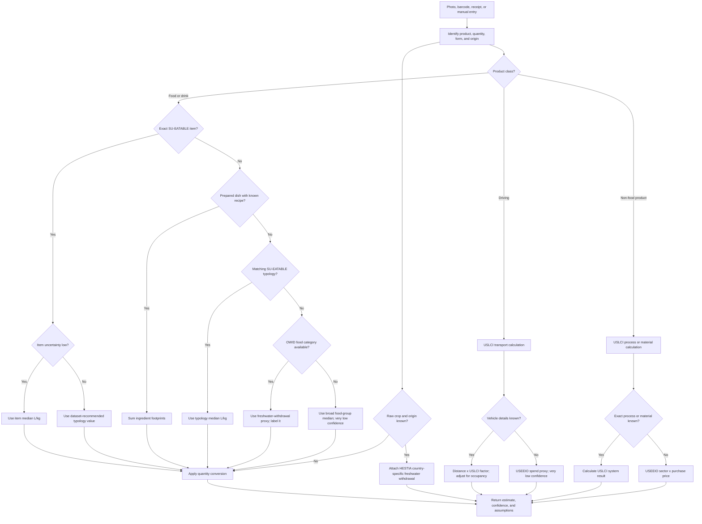

# Water Footprint Estimation Logic

## Canonical output

The primary food estimate is a **total volumetric water footprint in litres per product**, derived from litres per kilogram or litres per litre of product. Where available, total water footprint can include green, blue, and grey water.

Freshwater withdrawal and scarcity-weighted impact are separate metrics. They must never be silently averaged, summed, or substituted for the total footprint.

Every result must retain:

- normalized product and product form
- quantity and quantity source
- factor and functional unit
- metric type
- source dataset and record
- geography and system boundary
- match level
- confidence level
- assumptions and fallback reason

## Decision tree



## Food fallback order

1. **Exact SU-EATABLE item, low uncertainty:** use the item median.
2. **Exact item, high uncertainty:** follow `Suggested WF value`, normally the typology value.
3. **Regional estimate:** when origin is known and at least four compatible observations exist, use their regional median; otherwise use the global value.
4. **Prepared meal:** use a matching prepared-food factor; otherwise sum ingredient footprints.
5. **Nearest SU-EATABLE typology:** use the narrowest valid category, such as cheese rather than all dairy.
6. **OWID/Poore-Nemecek match:** use only as a labelled freshwater-withdrawal proxy.
7. **Broad group median:** return a very-low-confidence estimate and request better identification.

## v1 implementation notes

The engine ships steps 1, 2, and 4 through 7 of the fallback order above. The regional-median step (step 3) arrives in a later release, once enough origin-tagged observations are in the tables to make a regional median stand on its own. Today a known origin drives the country-specific HESTIA freshwater-withdrawal line shown alongside the headline.

One photo can resolve to several items. Each runs the tree on its own and keeps its own factor, metric, and confidence. When the plate is confirmed it is written as a single entry whose litres are the sum of the items that carry a headline: the lowest confidence on the plate wins, no match level is claimed for the whole, and no secondary metric is carried across. Items with no supported factor stay in the record without contributing a number.

## Calculations

Solid product:

```text
product footprint (L) = factor (L/kg) x net mass (kg)
```

Liquid product:

```text
product footprint (L) = factor (L/L product) x product volume (L)
```

Recipe:

```text
dish footprint (L) = sum of ingredient mass (kg) x ingredient factor (L/kg)
```

Driving:

```text
trip footprint (L) = vehicle-km factor x distance / occupancy
```

Use consumed mass for meal tracking and purchased mass for purchase tracking. Do not treat bone-in and bone-free meat as equivalent.

## Dataset roles

- **USDA FNDDS 2021–2023:** consumer food names, categories, and measured portions for catalog expansion. It contributes no water factor; reviewed category mappings resolve to SU-EATABLE typologies.
- **SU-EATABLE LIFE:** primary total volumetric food-water estimates and uncertainty-aware fallbacks.
- **HESTIA:** country-specific freshwater withdrawal for raw crops; attach as a secondary metric.
- **OWID / Poore-Nemecek:** physical freshwater-withdrawal fallback and cross-check for broad food categories.
- **USLCI:** transport activity coefficients only — fuel litres per passenger-kilometre. Its own water exchanges are not used; the water intensity of the fuel comes from cited literature. Electricity, materials, and other non-food processes are not calculable from the shipped package, so the modes resting on them are labelled unsupported.
- **USEEIO v2.0:** last-resort U.S. spend-based freshwater-withdrawal proxy.
- **USEEIO v2.5.1:** retained for other environmental indicators, but it has no water indicator and must not be used for water estimates.
- **Water Footprint Network Report 48:** reference for country/product green, blue, and grey animal-product footprints; older and PDF-based, so not a primary application lookup source.

## Confidence labels

- **High:** exact item, compatible metric and unit, reliable quantity, low uncertainty.
- **Medium:** regional or typology median with a reasonable product-form match.
- **Low:** global category, estimated serving size, or incomplete origin.
- **Very low:** broad group median, spend-based proxy, or incomplete product classification.

An estimate using a proxy must never be displayed without its metric type and fallback reason.
